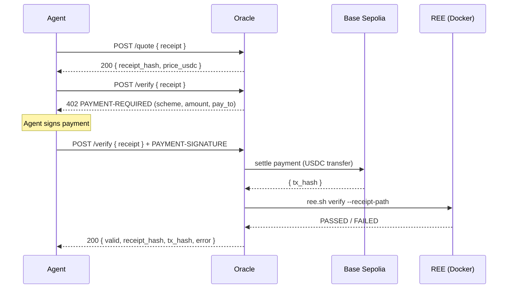

# REE Receipt Oracle

A pay-per-verification service for [Gensyn REE](https://github.com/gensyn-ai/ree) receipts, built on the [x402](https://github.com/coinbase/x402) payment protocol.

## What it does

Agents submit a REE receipt and pay a small USDC fee to have it independently verified. The oracle re-runs the inference via REE and confirms whether the receipt is valid — providing neutral, trustless liability attribution in an AI agent economy.

## How it works



**Liability logic:**
- Receipt **VALID** → inference reproduced exactly → the prompt drove the output → **human responsible**
- Receipt **INVALID** → output can't be reproduced → model was tampered or compromised → **liability shifts**

See [`agentic/blueprints/SERVICE_BLUEPRINT.md`](agentic/blueprints/SERVICE_BLUEPRINT.md) for the full design.

## Stack

- Python + FastAPI
- [x402](https://github.com/coinbase/x402) Python SDK
- Base Sepolia (`eip155:84532`)
- [Gensyn REE](https://github.com/gensyn-ai/ree) (Docker-based)

## Prerequisites

- [uv](https://docs.astral.sh/uv/) — Python package manager
- [Docker Desktop](https://www.docker.com/products/docker-desktop/) — required by REE for inference verification
- A wallet on Base Sepolia funded with test ETH and USDC
  - ETH (gas): [Coinbase Base Sepolia faucet](https://www.coinbase.com/faucets/base-ethereum-goerli-faucet)
  - USDC: [Circle faucet](https://faucet.circle.com) — select Base Sepolia
- The [Gensyn REE repo](https://github.com/gensyn-ai/ree) cloned locally

## Setup

**1. Clone and install:**
```bash
git clone https://github.com/luca-nik/ree-receipt-oracle.git
cd ree-receipt-oracle
uv sync
```

**2. Configure `.env`:**
```bash
cp .env.example .env
```

Edit `.env`:
```env
# Wallet address that receives USDC payments (Base Sepolia)
PAY_TO_ADDRESS=0xYourWalletAddress

# Network (Base Sepolia)
NETWORK=eip155:84532

# x402 facilitator
FACILITATOR_URL=https://x402.org/facilitator

# Absolute path to ree.sh in your local gensyn/ree clone
REE_SH_PATH=/path/to/ree/ree.sh

# Quote TTL in seconds
QUOTE_TTL_SECONDS=300
```

## Running the server

```bash
uv run uvicorn app.main:app --port 8765
```

The server starts at `http://localhost:8765`. On startup it contacts the x402 facilitator to fetch supported payment kinds — requires internet access.

## API

### `POST /quote`
Returns a price quote for verifying a receipt. Free, no payment required.

```bash
curl -X POST http://localhost:8765/quote \
  -H "Content-Type: application/json" \
  -d '{"receipt": <receipt-json>}'
```

Response:
```json
{
  "receipt_hash": "sha256-hex",
  "price_usdc": "0.01",
  "expires_at": 1234567890
}
```

### `POST /verify`
x402-protected. Returns 402 with payment requirements on first call; submit again with `PAYMENT-SIGNATURE` header to settle and run verification.

```bash
curl -X POST http://localhost:8765/verify \
  -H "Content-Type: application/json" \
  -d '{"receipt": <receipt-json>}'
```

### `GET /health`
```bash
curl http://localhost:8765/health
```

## Pricing

Flat fee per model (USDC on Base Sepolia):

| Model | Price |
|---|---|
| Qwen/Qwen3-0.6B | $0.01 |
| Qwen/Qwen3-1.7B | $0.02 |
| Qwen/Qwen3-4B | $0.05 |
| Qwen/Qwen3-8B | $0.10 |
| Qwen/Qwen3-14B | $0.20 |
| Qwen/Qwen3-32B | $0.50 |

## Client library

Install and use `OracleClient` directly in your agent:

```python
import asyncio, json, os
from ree_oracle_client import OracleClient
from ree_oracle_client.exceptions import PaymentError, OracleNetworkError

async def main():
    client = OracleClient(
        oracle_url="http://localhost:8765",
        private_key=os.environ["ORACLE_CLIENT_PRIVATE_KEY"],
    )
    receipt = json.load(open("test-receipts/receipt_20260402_173254.json"))

    result = await client.verify(receipt)
    if result.valid:
        print("VALID — human accountable")
    else:
        print(f"INVALID — liability shifts: {result.error}")

asyncio.run(main())
```

See [`examples/agent_pipeline.py`](examples/agent_pipeline.py) for a full example with exception handling.

## CLI

```bash
# Price quote — free, no payment
uv run ree-oracle quote test-receipts/receipt_20260402_173254.json

# Full verification — pays USDC, runs REE
uv run ree-oracle verify test-receipts/receipt_20260402_173254.json

# Options
uv run ree-oracle verify <receipt.json> --oracle-url http://other:8765 --private-key 0x...
```

The private key is read from `ORACLE_CLIENT_PRIVATE_KEY` in `.env` automatically.

`verify` prints step-by-step progress to stderr and final JSON to stdout, so it composes cleanly:

```bash
uv run ree-oracle verify receipt.json | jq .valid
```

## Testing

Sample receipts are in `test-receipts/` — all generated with `Qwen/Qwen3-0.6B`, `operation_set: reproducible`.

### Generate your own receipt

```bash
cd /path/to/ree
./ree.sh --model-name Qwen/Qwen3-0.6B --prompt-text "2+2?" --max-new-tokens 50
```

> Use the TUI (`python3 ree.py`) and set **Operation Set** to `reproducible` — this ensures the receipt can be verified.

The receipt is saved to `~/.cache/gensyn/`.

### Confirm with REE directly

```bash
RECEIPT=$(find ~/.cache/gensyn -name "receipt_*.json" | sort | tail -1)
./ree.sh verify --receipt-path $RECEIPT
# should print: VERIFICATION PASSED
```

### End-to-end test

Add your wallet private key to `.env`:
```env
ORACLE_CLIENT_PRIVATE_KEY=0x...
```

In Terminal 1:
```bash
uv run uvicorn app.main:app --port 8765
```

In Terminal 2:
```bash
uv run ree-oracle verify test-receipts/receipt_20260402_173254.json
```

## License

MIT
